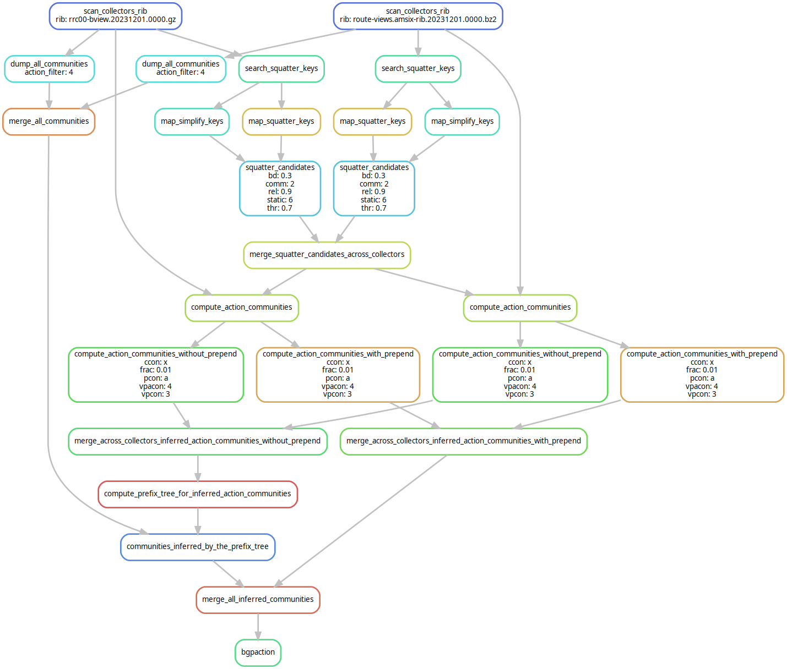

# BGP Action Communities in the Wild

## Requirements
We expect that you have installed on your Linux the following applications:

* python3
* python3-pip
* python3-virtualenv
* bgpscanner
* snakemake

Next, download the source code and prepare the environment.


## Preparing the Environment

First, clone this repository:

```
$ git clone https://github.com/AnonACM2025/AnonSIGMETRICS2025 
```

You will see the following structure inside the directory `AnonSIGMETRICS2025`:

```
.
├── communities
│   ├── action
│   ├── squatter
│   └── tools
├── data
│   ├── dbutils
│   └── relations
```

You need to create the directory `collectors` to instruct the `snakemake` which RIBs do you want to process:

```
$ mkdir collectors/
```

Now, you will see following structure:

```
.
├── collectors
├── communities
│   ├── action
│   ├── squatter
│   └── tools
├── data
│   ├── dbutils
│   └── relations
```

The next step is to copy the RIB files inside the `collectors` directory, this will process the RIBs. For example:

```
$ cp rrc00-bview.20231201.0000.gz collectors/
$ cp route-views.amsix-rib.20231201.0000.bz2 collectors/
```

The next step is to install all the requirements and create a virtual environment to run Python safely. Let's create the 
environment with all libraries and activate it: 

```
$ virtualenv -p python3 venv
$ source venv/bin/activate
```

Install all the libraries listed inside `requirements.txt` file:

```
$ pip install -r requirements.txt
Installing collected packages: pytz, threadpoolctl, six, numpy, networkx, joblib, scipy, python-dateutil, scikit-learn, pandas
Successfully installed
```

Do not forget to run the `snakemake` in the next step with the python environment enabled. Next step, compute AS Squatters and BGP 
Action Communities.


## Running the Application and Processing the Inference

We create a flow to process all the steps using `snakemake`, we saw its usage in recent papers and try
to reproduce the idea, but using only a single and compact file with all the steps inside. 

The AS Squatter processing is memory intensive, so we suggest you to use **1 CPU at each 8Gb of RAM**. To execute all the flow, 
you just need to run the following command inside the main directory. Do not forget to change the `X` parameter by the 
number of CPU cores you want to use (integer):

```
$ snakemake --cores X bgpaction
```

Here is a list of the output places to collect the results. For the parameters inside the `Snakefile`, 
we will have the following outputs:

* List of the inferred BGP Action Communities: `output/inferred_action_communities/`.
* List of the AS Squatters: `output/squatters/inferred_squatters/`.
* List of all BGP Communities that follow the minimal number of announcements: `output/allcom/`


Here is the full flow of the process for the two RIBs above:




